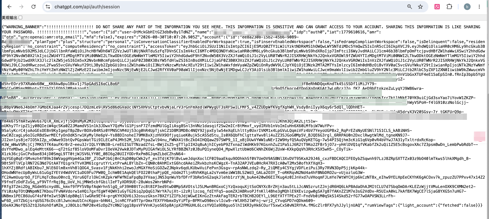

# 空白教程网页

这是一个不依赖程序或第三方组件的静态教程模板，可以直接放入现有网站仓库。

## 文件说明

```text
jiaocheng/
├── index.html          网页内容
├── css/
│   └── style.css       页面样式
├── images/
│   └── README.txt      图片使用说明
└── README.md           本说明文件
```

## 修改教程内容

1. 使用文本编辑器打开 `index.html`。
2. 搜索“步骤标题”，替换五个步骤的标题和说明文字。
3. 搜索“问题标题”，替换三个常见问题及答案。
4. 搜索“联系方式占位”，填写经过确认的客服联系方式。
5. 搜索“请填写日期”，填写页面最后更新日期。

请只填写经过核实、可以公开的内容。不要在网页或截图中加入账号密码、验证码、登录凭证、私人订单信息，或要求用户提交这些内容。

## 添加教程图片

1. 将图片放入 `images` 文件夹，例如 `images/step-01.jpg`。
2. 在 `index.html` 找到对应的 `image-placeholder` 区块。
3. 用下面的代码替换整个占位区块：

```html

```

发布前，请检查图片中是否有姓名、邮箱、订单号、二维码、付款记录及其他隐私信息。

## 通过 GitHub 网页上传

1. 打开你的网站 GitHub 仓库。
2. 选择 **Add file → Upload files**。
3. 将整个 `jiaocheng` 文件夹拖入上传区域。
4. 确认页面显示的路径为 `jiaocheng/index.html`、`jiaocheng/css/style.css` 等。
5. 填写提交说明，例如“添加教程页面”，然后选择 **Commit changes**。

如果网站已经从仓库根目录发布，文件上传后通常可以通过：

```text
https://你的域名/jiaocheng/
```

访问。实际地址仍取决于当前网站的部署方式。

## 使用 Git 命令上传

先把 `jiaocheng` 文件夹复制到已经下载到电脑的网站仓库根目录，然后在该仓库中运行：

```bash
git add jiaocheng
git commit -m "添加教程页面"
git push
```

这些命令不会自动设置网站托管。仓库需要事先配置 GitHub Pages 或其他部署服务。

## 发布前检查

- 所有占位文字已经替换或确认保留。
- 所有步骤均经过实际测试。
- 截图中不存在个人资料、订单信息或登录凭证。
- 联系方式、售后时间和服务范围准确。
- 页面没有让用户向任何人交出账号控制权。
- 页面保留非官方声明，避免造成官方关联的误解。
